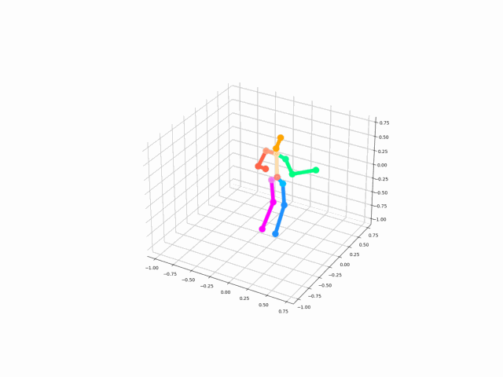
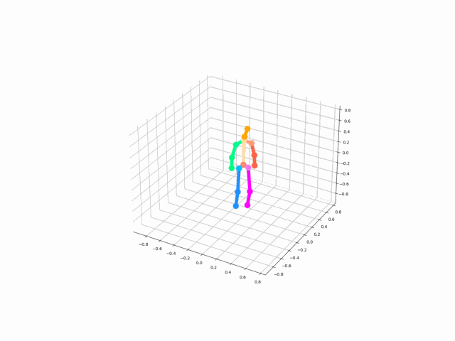
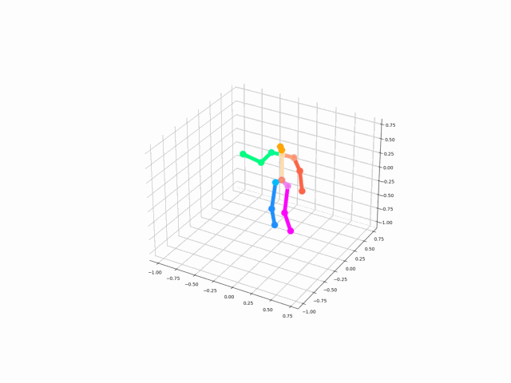
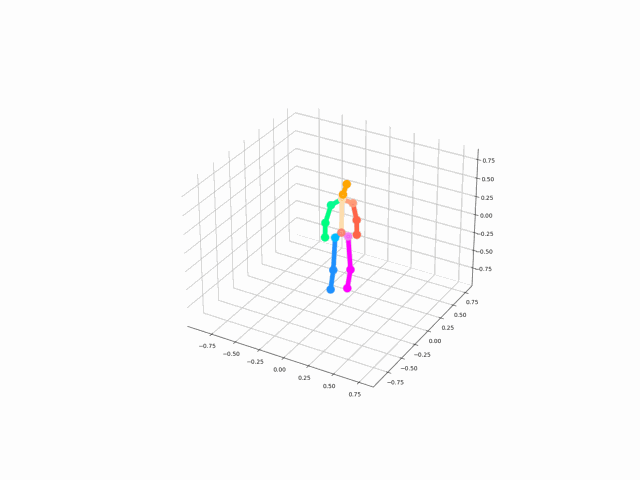
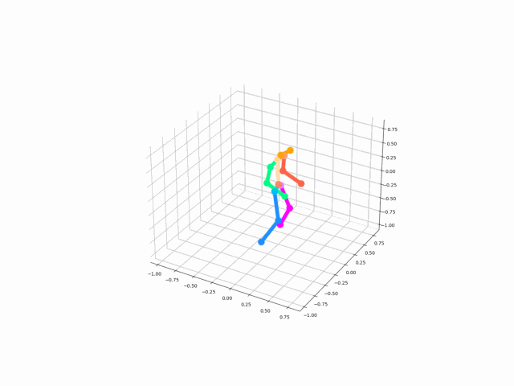
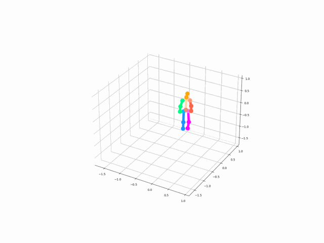

# Rapport et compte rendu de la réunion
### Résultat numérique
L'erreur au cours de l'entraînement est minimisée jusqu'à 100 mm, 2 fois moins qu'avant. Cependant, il n'y a pas une amélioration notable au niveau du mouvement. En observant l'évaluation sur les données de CMU, on remarque que cette amélioration lors de l'entraînement à réduit les résultats précédent(plus précisément sur le break dance). Ce qui est normal puisque les poses présentent dans cette class de mouvement sont inexistantes dans la base de données d'apprentissage. De plus, cette catégories de mouvement reste très compliqué même dans l'état de l'art (mouvements avec le corps renversé).

#### &nbsp;&nbsp;&nbsp;&nbsp;&nbsp;&nbsp;Ancien modèle

<figure>
    
    <figcaption align="center">Figure 1: Evolution de l'erreur MPJPE lors de l'entraînement de l'ancien modèle.</figcaption>
</figure>
 
<table>
  <caption style="caption-side:bottom">Table 1: Tableau présentant les résultats d'évaluation de l'ancien modèle. </caption>
  <thead>
    <tr>
      <th colspan="2">Basketball</th>
      <th colspan="2">Break Dance</th>
      <th colspan="2">Average</th>
    </tr>
  </thead>
  <tbody>
    <tr>
      <td>MPJPE</td>
      <td>3DPCK</td>
      <td>MPJPE</td>
      <td>3DPCK</td>
      <td>MPJPE</td>
      <td>3DPCK</td>
    </tr>
    <tr>
      <td>206.6</td>
      <td>54.59</td>
      <td>264.6</td>
      <td>45.54</td>
      <td>235.6</td>
      <td>50.07</td>
    </tr>
  </tbody>
</table>

 

#### &nbsp;&nbsp;&nbsp;&nbsp;&nbsp;&nbsp;Modèle amélioré

<figure>
    
    <figcaption align="center">Figure 2: Evolution de l'erreur MPJPE lors de l'entraînement de l'ancien modèle.</figcaption>
</figure>
 
<table>
  <caption style="caption-side:bottom">Table 2: Tableau présentant les résultats d'évaluation du modèle amélioré. </caption>
  <thead>
    <tr>
      <th colspan="2">Basketball</th>
      <th colspan="2">Break Dance</th>
      <th colspan="2">Average</th>
    </tr>
  </thead>
  <tbody>
    <tr>
      <td>MPJPE</td>
      <td>3DPCK</td>
      <td>MPJPE</td>
      <td>3DPCK</td>
      <td>MPJPE</td>
      <td>3DPCK</td>
    </tr>
    <tr>
      <td>202.3</td>
      <td>53.78</td>
      <td>600.4</td>
      <td>41.43</td>
      <td>401.3</td>
      <td>47.61</td>
    </tr>
  </tbody>
</table>

> Comme on le présente les tableaux Table 1 et Table 2, le modèle amélioré présente une erreur plus petite lors de l'entraînement. Mais cela implique qu'il s'adapte moins au mouvements qui ne sont pas représentés, notamment le "Break Dance".

#### Exemples de mouvement
|Vérité terrain|Estimation|
|-----|-----|
|||
|||
|||

### Idées évoquées lors de la réunion
Avec l'architecture actuelle du modèle, lors de l'entraînement, la perte (MPJPE) est calculé non seulement sur l'ensemble des articulations mais aussi sur l'ensemble des mouvement. Ceci implique que le modèle calcule une moyenne sur l'ensemble du mouvement et donc n'arrive pas à très bien le reconstruire. Afin de remédier à ce problème, les propositions suivantes ont été évoquées:

1. Estimation par articulation
Cette idée propose de subdivisé le modèle en 16 sous-modèles indépendants chargé chacun d'estimer la position de chaque articulation. 

<figure>
    
    <figcaption align="center">Figure 3: Principe d'entraînement de l'architecture par sous-modèles.</figcaption>
</figure>

> Cette architecture permettra à chaque sous-modèle d'apprendre la position d'une et une seule articulation. On peut améliorer cette architecture en focalisant l'entraînement sur la trajectoire de l'articulation dans le temps (fonction de perte).

2. Estimation par partie du corps.

L'idée de cette approche est de regrouper les articulations par parties du corps. La perte sera donc calculée et appliquée par partie du corps comme le montre la Figure 4.

<figure>
    
    <figcaption align="center">Figure 4: Principe d'entraînement de l'architecture par sous-modèles.</figcaption>
</figure>

> Pour cette architecture tout comme pour une arcitecture qui estime directement l'ensemble du articulations, l'erreur MPJPE reste insuffisante. Il faudra probablement envisagé d'autres fonctions de perte plus adaptées.

3. Fonction de perte

Lors de la réunion nous avons évoqué 4 variété de la fonction MPJPE.
* Equation 1
$\frac{1}{T}\sum_{t=1}^{T} \frac{1}{J}\sum_{j=1}^{J}$