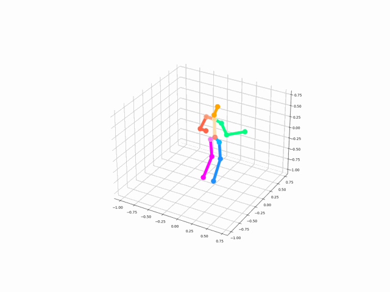
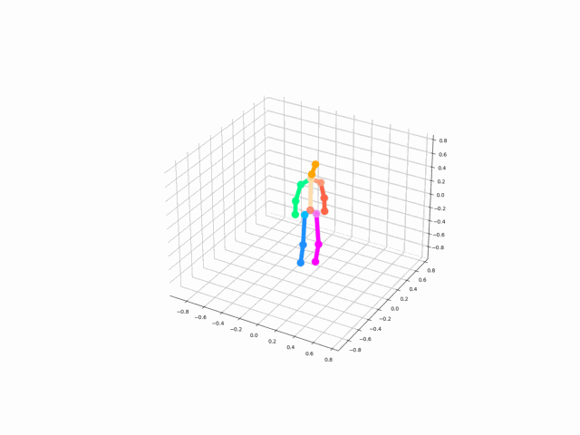
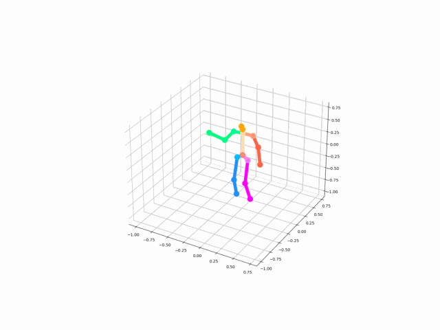
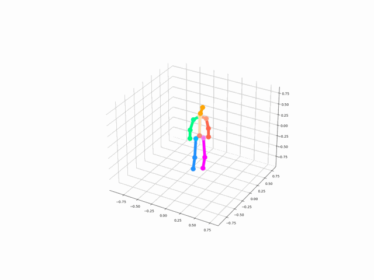

# Rapport et compte rendu de la réunion
## Résultat numérique
L'erreur au cours de l'entraînement est minimisée jusqu'à 100 mm, 2 fois moins qu'avant. Cependant, il n'y a pas une amélioration notable au niveau de la qualité du mouvement. En observant l'évaluation sur les données de CMU, on remarque que cette amélioration lors de l'entraînement a réduit les résultats précédent plus précisément sur le break dance. Ce qui est normal puisque les poses présentent dans cette classe de mouvement sont inexistantes dans la base de données d'apprentissage. De plus, cette catégories de mouvement reste très compliqué même dans l'état de l'art (mouvements avec le corps renversé).

***

### &nbsp;&nbsp;&nbsp;&nbsp;&nbsp;&nbsp;Ancien modèle

*Figure 1: Evolution de l'erreur MPJPE lors de l'entraînement de l'ancien modèle.*

| Motion      | MPJPE | 3DPCK |
| :--------:  | :---: | :---: |
| Basketball  | 206.6 | 54.59 |
| Break Dance | 264.6 | 45.54 |
| Average     | 235.6 | 50.07 |

*Table 1: Tableau présentant les résultats d'évaluation de l'ancien.*

***

### &nbsp;&nbsp;&nbsp;&nbsp;&nbsp;&nbsp;Modèle amélioré

*Figure 2: Evolution de l'erreur MPJPE lors de l'entraînement du modèle amélioré.*

| Motion      | MPJPE | 3DPCK |
| :--------:  | :---: | :---: |
| Basketball  | 202.3 | 53.78 |
| Break Dance | 600.4 | 41.43 |
| Average     | 401.3 | 47.61 |

*Table 2: Tableau présentant les résultats d'évaluation du modèle amélioré.*

> Comme on le présente les tableaux Table 1 et Table 2, le modèle amélioré présente une erreur plus petite lors de l'entraînement. Mais cela implique qu'il s'adapte moins au mouvements qui ne sont pas représentés, notamment le "Break Dance".

***

### &nbsp;&nbsp;&nbsp;&nbsp;&nbsp;&nbsp;Exemples de mouvement

|Vérité terrain|Estimation|
|-----|-----|
|||
|||
|||

***

## Idées évoquées lors de la réunion
Avec l'architecture actuelle du modèle, lors de l'entraînement, la perte (MPJPE) est calculé non seulement sur l'ensemble des articulations mais aussi sur l'ensemble des mouvement. Ceci implique que le modèle calcule une moyenne sur l'ensemble du mouvement et donc n'arrive pas à très bien le reconstruire. Afin de remédier à ce problème, les propositions d'améliorations suivantes ont été évoquées:

1. Estimation par articulation
Cette idée propose de subdivisé le modèle en 16 sous-modèles indépendants chargé chacun d'estimer la position de chaque articulation. 

*Figure 3: Principe d'entraînement de l'architecture par sous-modèles.*

> Cette architecture permettra à chaque sous-modèle d'apprendre la position d'une et une seule articulation. On peut améliorer cette architecture en focalisant l'entraînement sur la trajectoire de l'articulation dans le temps (fonction de perte).

2. Estimation par partie du corps

L'idée de cette approche est de regrouper les articulations par parties du corps. La perte sera donc calculée et appliquée par partie du corps comme le montre la Figure 4.

*Figure 4: Principe d'entraînement de l'architecture par sous-modèles.*

> Pour cette architecture tout comme pour une arcitecture qui estime directement l'ensemble du articulations, l'erreur MPJPE reste insuffisante. Il faudra probablement envisagé d'autres fonctions de perte plus adaptées.

3. Fonction de perte

Lors de la réunion nous avons évoqué 4 variétés de la fonction MPJPE.
Soit *T* et *J* respectivement la taille de la séquence et le nombre d'articulations. On a:
* Equation 1:

$$\epsilon_{j,t}=\Vert\overline{p}_{t}^{j}-p_{t}^{j}\Vert$$

> Pour cette première équation, on a l'erreur pour une articulation *j* à un instant *t* de la séquence. C'est la distance entre la position réelle et la position estimée de l'articulation.

* Equation 2:

$$\epsilon=\frac{1}{J}\sum_{j=1}^{J}\epsilon_{j,t}$$

> L'équation 2 représente l'erreur moyenne par articulation pour une seul frame. Elle renverra dans ce cas, une liste d'erreur de taille *T*. 

* Equation 3:

$$\epsilon=\frac{1}{T}\sum_{t=1}^{T}\epsilon_{j,t}$$

> Cette erreur représente la moyenne d'erreur tout au long de la séquence pour une articulation données. On obtient donc dans notre cas une liste d'erreur de taille *J=16*.

* Equation 4:

$$\epsilon=\frac{1}{T}\sum_{t=1}^{T} \frac{1}{J}\sum_{j=1}^{J}\epsilon_{j,t}$$

> Cette équation représente l'erreur moyenne par articulation et sur l'ensemble de la séquence. C'est un scalaire. C'est aussi l'erreur que nous utilisons actuellement.

On pourra envisager l'idée d'une erreur par groupe d'articulations dans le cas de l'estimation par partie du corps. Le problème actuelle avec les équations 2 et 3 est que l'erreur lors d'un entraînement dans l'apprentissage profond doit être un scalaire et de ce fait la moyenne sur la liste d'erreur est automatiquement calculée.

## Suite de la thèse

1. Afin de s'assurer que le problème vient du faites que nous travaillons sur toute la séquence, il serait intéressant de tester un modèle d'estimation de frame à frame et concatener le résultat pour observation.
2. Adapter et entrainer le modèle de MotioNet et observer le résultat. Cela permettra de comprendre si le problème vient du fait que l'on estime directement les poses sans passer par les rotations.
3. Penser à une nouvelle fonction de perte adapter au mouvement.
4. Mettre en place la phase de lissage spatio-temporelle utilisant la représentation Laplacienne.

