# Rapport d'evaluation du modèle CVMNet

## Architecture du modèle
On considère une pose par un vecteur des positions des articulations du squelette. On simplifie le squelette à un nombre d'articulations J=17.
Une séquence de pose est une suite de vecteurs décrivant les poses du squelette en fonction du temps. On considère en comme donnée d'entrée du modèle une séquence de poses en 2D qu'on note  et comme donnée résultat une séquence de pose en 3D .
L'objectif du modèle est de calculer la transformation 2D vers 3D du séquence de pose de longueur T :

})

 est de dimension [1,T,2xJ] et  est de dimension [1,T,3xJ]

Voici l'architecture du modèle utilisé pour réaliser cette tâche:

*Figure1: Architecture du modèle d'estimation de poses 3D*

## Evaluation avec la base de données Human3.6m

On évalue le modèle en utilisant le Protocol#1 du benchmark Human3.6m. Le tableau Table 1 ci-après représente les résultats de l'évaluation.

*Table1: Tableau comparatif des résultats de l'évaluation des différents modèles. Les modèles CVMNet ont été entraîné pendant 150 epochs sauf le celui avec la fonction laplacienne qui a été entrainé sur 50 epochs pour des raisons de complexité temporelle.*

Modèles | Directions | Discussion | Eating | Greeting | Phoning | Photo | Posing | Purchases | Sitting | SittingDown | Smoking | Waiting | WalkDog | Walking | WalkTogether | Average |
:--:|:--:|:--:|:--:|:--:|:--:|:--:|:--:|:--:|:--:|:--:|:--:|:--:|:--:|:--:|:--:|:--:|
CVMNet (1 bloc) | 85.25 | 129.41 | 109.17 | 101.22 | 117.17 | 137.31 | 86.12 | 293.37 | 152.75 | 248.98 | 119.87 | 105.45 | 261.62 | 87.20 | 87.81 | 142.47 |
CVMNet (2 blocs) | 89.18 | 121.00 | 135.62 | 101.21| 130.79 | 137.12 | 85.83 | 226.98 | 191.31 | 261.97 | 133.23 | 103.17 | 218.35 | 83.93 | 86.03 | 141.25 |
CVMNet (1 bloc) + Motion Loss | 83.67 | 107.73 | 118.72 | 95.51 | 113.39 | 131.98 | 82.64 | 221.00 | 148.74 | 232.07 | 113.56 | 95.76 | 195.00 | 85.04 | 83.95 | 127.99 |
CVMNet (2 blocs) + Motion Loss | 80.42 | 109.11 | 116.61 | 91.58 | 123.84 | 127.46 | 83.96 | 169.57 | 162.69 | 224.39 | 120.81 | 97.64 | 175.52 | 84.30 | 84.20 | 124.20 |
CVMNet (1 bloc) + Laplacian Loss | 101.87 | 109.28 | 132.03 | 112.66 | 132.24 | 137.74 | 101.83 | 143.06 | 173.79 | 250.92 | 132.66 | 108.66 | 148.33 | 102.81 | 107.41 | 133.55 |
MotioNet | 45.48 | 51.28 | 49.43 | 51.91 | 52.58 | 66.46 | 50.59 | 48.46 | 55.90 | 64.25 | 53.79 | 52.84 | 58.85 | 49.99 | 48.25 | 53.47 |

### Quelques résultats graphiques
Action | Vérité terrain | Motionet | CVMNet(1bloc + Motion Loss) | CVMNet(2blocs + Motion Loss) |
:-----:|:-----:|:-----:|:-----:|:-----:|
 Directions |  | 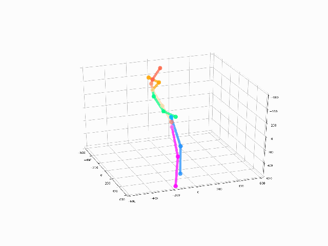 |  |  |
 Discussion |  |  |  |  |
 Eating | 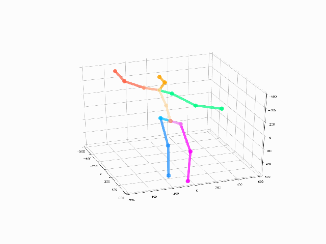 |  | 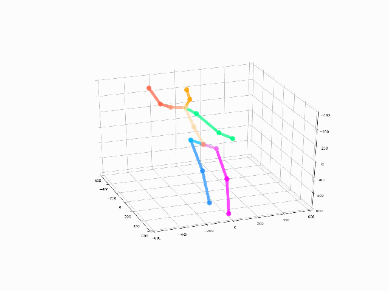 | 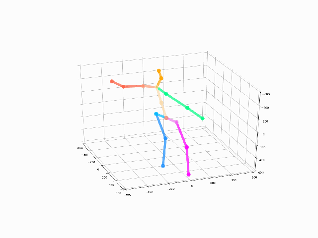 |
 Greeting |  |  |  |  |
 Photo | 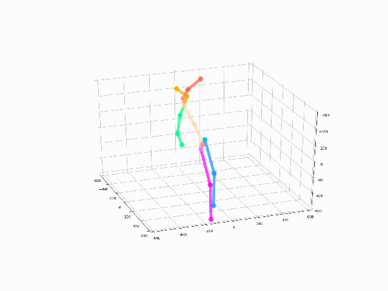 | 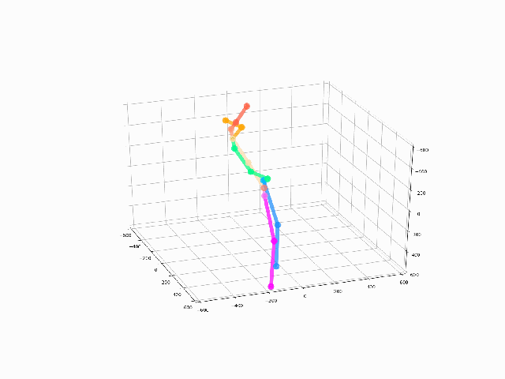 |  | 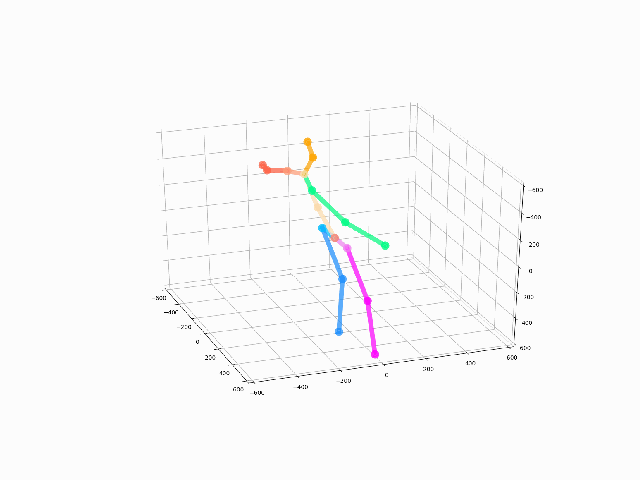 |
 Posing |  |  |  |  |
 Purchases |  |  |  |  |
 Sitting |  | 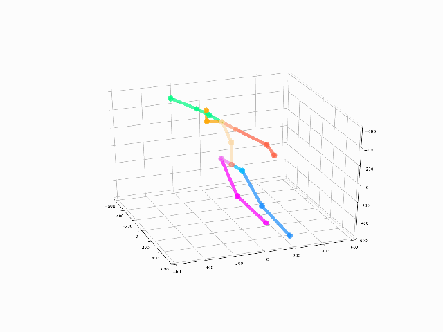 |  |  |
 SittingDown |  |  |  |  |
 Smoking |  |  |  |  |
 Waiting | 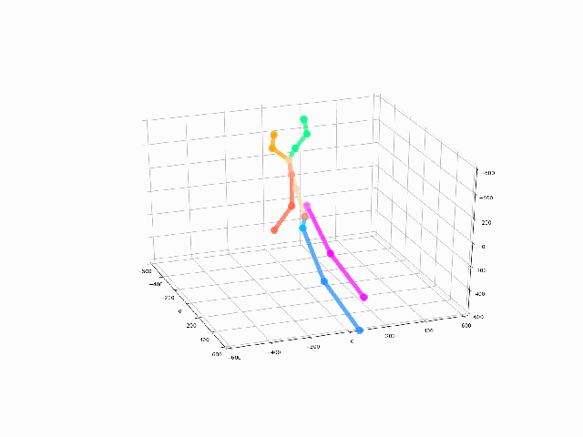 |  |  |  |
 WalkDog | 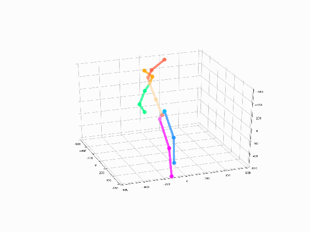 |  |  | 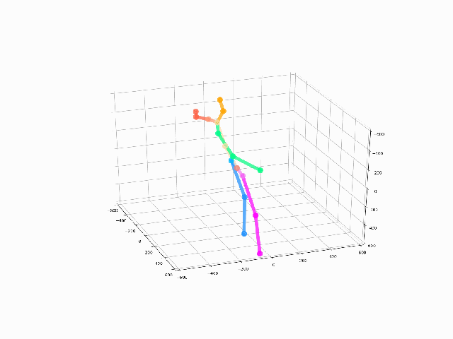 |
 Walking |  |  |  |  |
 WalkTogether |  |  |  |  |

### Résultats qualitatifs avec le modèle CVMNet (1 bloc + Laplacian Loss)
Action | CVMNet(1bloc + Laplacian Loss) |
:-----:|:-----:|
 Directions | 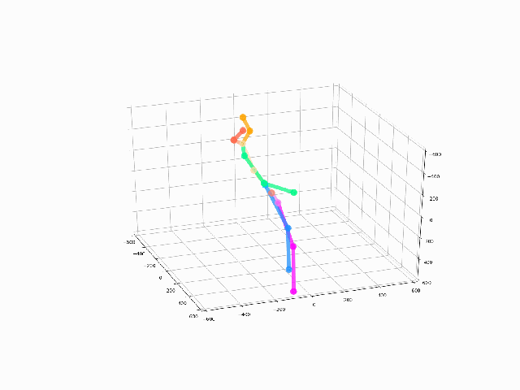 |
 Discussion |  |
 Eating | 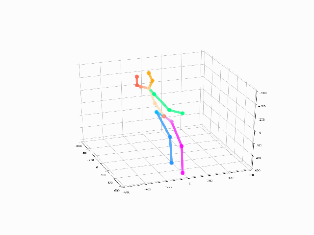 |
 Greeting |  |
 Photo | 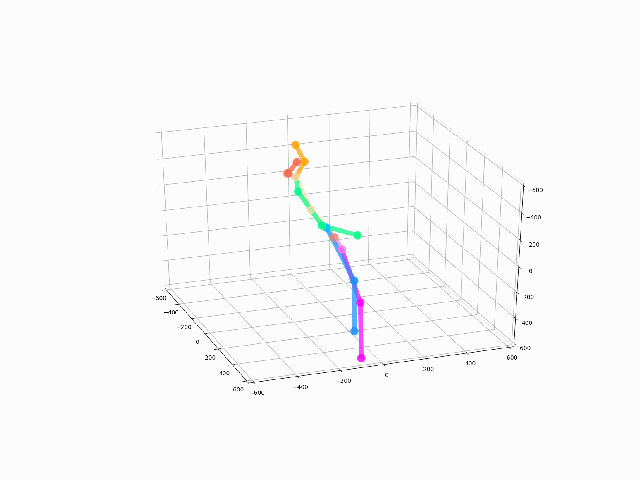 |
 Posing |  |
 Purchases | 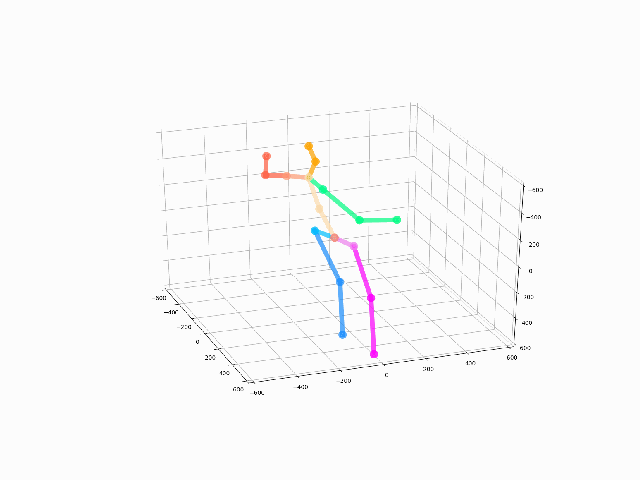 |
 Sitting | 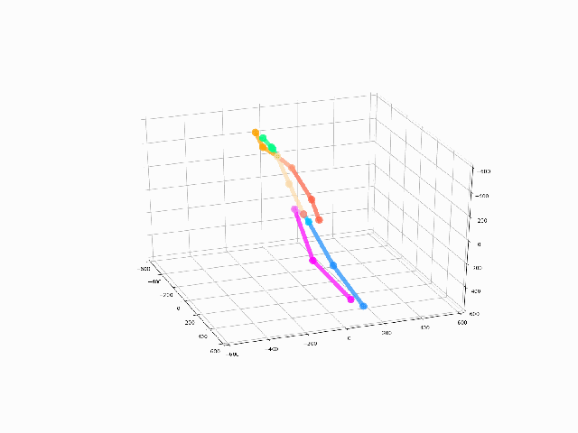 |
 SittingDown |  |
 Smoking |  |
 Waiting |  |
 WalkDog | 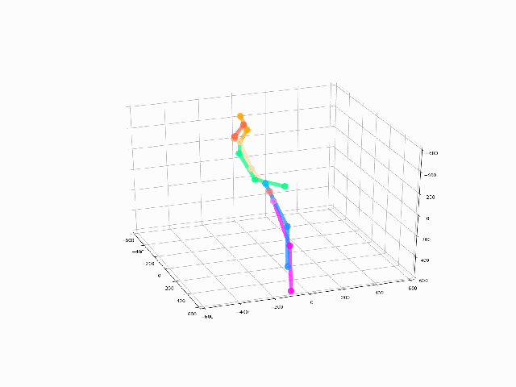 |
 Walking |  |
 WalkTogether |  |