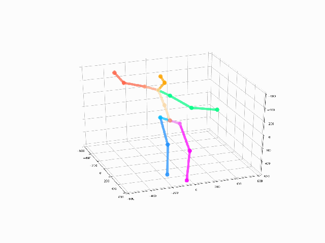
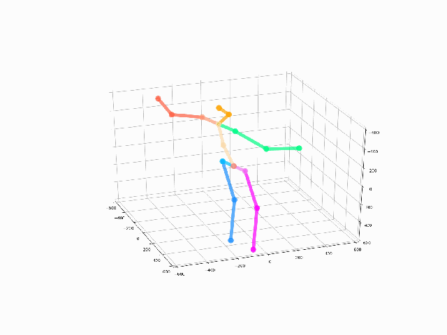
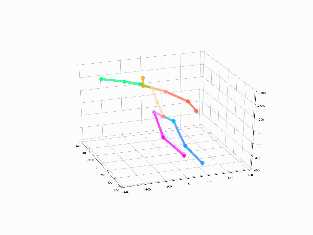
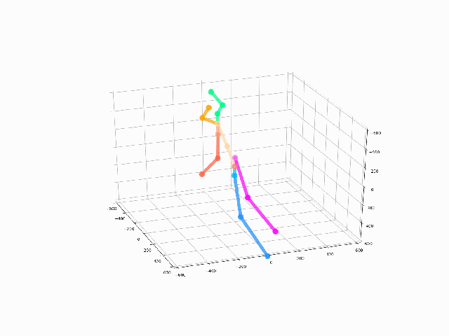
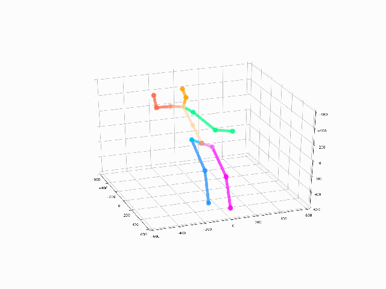
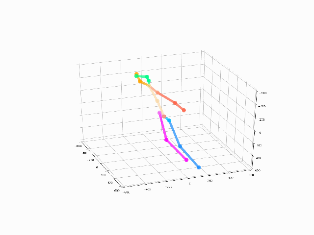
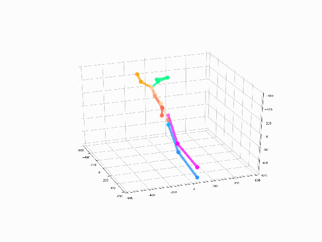

# Rapport d'evaluation du modèle CVMNet

## Architecture du modèle

On considère une pose par un vecteur des positions des articulations du squelette. On simplifie le squelette à un nombre d'articulations J=17.

Une séquence de pose est une suite de vecteurs décrivant les poses du squelette en fonction du temps. On considère en comme donnée d'entrée du modèle une séquence de poses en 2D qu'on note  et comme donnée résultat une séquence de pose en 3D .
L'objectif du modèle est de calculer la transformation 2D vers 3D du séquence de pose de longueur T :

<!-- Une séquence de pose est une suite de vecteurs décrivant les poses du squelette en fonction du temps. On considère en comme donnée d'entrée du modèle une séquence de poses en 2D qu'on note $P_{2D}$ et comme donnée résultat une séquence de pose en 3D $P_{3D}$.
L'objectif du modèle est de calculer la transformation 2D vers 3D du séquence de pose de longueur T : -->

})

<!-- $$
P_{3D}=f(P_{2D})
$$ -->

 est de dimension [1,T,2xJ] et  est de dimension [1,T,3xJ]
<!-- $P_{2D}$ est de dimension [1,T,2xJ] et $P_{3D}$ est de dimension [1,T,3xJ] -->

Voici l'architecture du modèle utilisé pour réaliser cette tâche:

*Figure1: Architecture du modèle d'estimation de poses 3D*

## Evaluation avec la base de données Human3.6m

### 1. Evaluation Mean Per Joint Position Error

On évalue le modèle en utilisant le Protocol#1 du benchmark Human3.6m. Le tableau Table 1 ci-après représente les résultats de l'évaluation.

*Table1: Tableau comparatif des résultats de l'évaluation des différents modèles. Les modèles CVMNet ont été entraîné pendant 150 epochs sauf le celui avec la fonction laplacienne qui a été entrainé sur 50 epochs pour des raisons de complexité temporelle. Les meilleures valeures pour les modèles CVMNet sont mises en gras.*

|                  Modèles                  | Directions | Discussion |   Eating   | Greeting  |  Phoning   |   Photo    |  Posing   | Purchases |  Sitting   | SittingDown |  Smoking   |  Waiting  |  WalkDog   |  Walking  | WalkTogether |  Average   |
| :---------------------------------------: | :--------: | :--------: | :--------: | :-------: | :--------: | :--------: | :-------: | :-------: | :--------: | :---------: | :--------: | :-------: | :--------: | :-------: | :----------: | :--------: |
|              CVMNet (1 bloc)              |   85.25    |   129.41   |   109.17   |  101.22   |   117.17   |   137.31   |   86.12   |  293.37   |   152.75   |   248.98    |   119.87   |  105.45   |   261.62   |   87.20   |    87.81     |   142.47   |
|             CVMNet (2 blocs)              |   89.18    |   121.00   |   135.62   |  101.21   |   130.79   |   137.12   |   85.83   |  226.98   |   191.31   |   261.97    |   133.23   |  103.17   |   218.35   |   83.93   |    86.03     |   141.25   |
|       CVMNet (1 bloc) + Motion Loss       |   83.67    |   107.73   |   118.72   |   95.51   |   113.39   |   131.98   |   82.64   |  221.00   |   148.74   |   232.07    |   113.56   |   95.76   |   195.00   |   85.04   |    83.95     |   127.99   |
|      CVMNet (2 blocs) + Motion Loss       |   80.42    |   109.11   |   116.61   |   91.58   |   123.84   |   127.46   |   83.96   |  169.57   |   162.69   |   224.39    |   120.81   |   97.64   |   175.52   |   84.30   |    84.20     |   124.20   |
|     CVMNet (1 bloc) + Laplacian Loss      |   80.77    | 82.53  | **104.96** |   87.07   | **101.80** |   107.00   |   77.41   |   98.85   | **137.33** | **178.99**  | **103.43** |   84.37   | **104.32** |   79.16   |  **76.30**   | **100.62** |
|     CVMNet (2 blocs) + Laplacian Loss     |   93.29    |   105.10   |   125.78   |  100.43   |   122.13   |   123.24   |   91.52   |  126.30   |   160.37   |   218.60    |   124.29   |   98.24   |   151.97   |   95.67   |    97.28     |   122.77   |
|  CVMNet (1 bloc 2048 c1 *) + Motion Loss  | **75.87**  |   **81.21**    |   121.50   | **79.82** |   108.64   | **105.01** | **74.01** | **96.15** |   163.11   |   218.32    |   111.94   | **82.91** |   111.98   | **77.02** |    78.16     |   106.22   |
| CVMNet (1 bloc 2048 c1*) + Laplacian Loss |   76.98    |   95.12    |   106.14   |   86.94   |   100.74   |   112.23   |   77.00   |  152.71   |   151.51   |   252.53    |   106.39   |   90.08   |   161.60   |   87.28   |    81.97     |   116.61   |
|                 MotioNet                  |   45.48    |   51.28    |   49.43    |   51.91   |   52.58    |   66.46    |   50.59   |   48.46   |   55.90    |    64.25    |   53.79    |   52.84   |   58.85    |   49.99   |    48.25     |   53.47    |

**2048 c1 correspond à un channels de 2048 pour la première couche de convolution du bloc*

On peut remarquer qu'on obtient les meilleurs résultats avec lorsqu'on utilise les fonctions de pertes Motion Loss ou Laplacian Loss. On peut aussi noter qu'augmenter la valeur du *channels* de convolution à de meilleurs effets que de rajouter un bloc de sous-réseau supplémentaires(cas des exemples CVMNet + Motion Loss).

### 2. Evaluation des performances temporelles: la métrique MPJDE

Afin d'évaluer les performances des modèles sur l'aspect temporelle, on utilise la métrique **Mean Per Joint Delta Error** *MPJDE(&tau;)* qui représente la moyenne des erreurs des différentiels temporels moyens(on note *&delta;j,&tau;*) par articulation pour un interval de temps *&tau;*. Un différentiel temporel *&delta;j,&tau;,t* représente pour une articulation j à un instant t, la distance par unité de temps entre sa position à l'instant _t-&tau;_ et celle à l'instant _t+&tau;_ :

Voici comment se calcule *dtm(j,&tau;)*:

On a alors la _MPJDE(&tau;)_, calculé entre l'estimation et la vérité terrain qui s'obtient par l'équation: 

 ;

 correspond le différentiel temporel moyen sur l'estimation et  le différentiel temporel moyen sur la vérité terrain.

Le tableau qui suit compare la _MPJDE(&tau;=1)_ pour entre les deux meilleures modèles CVMNet et MotioNet.

*Table2: Tableau comparatif de la MPJDE(&tau;=1) entre les différents modèles. D'après l'équation, on a des valeurs en mm/frame.*

|                Modèles                | Directions | Discussion | Eating | Greeting | Phoning | Photo | Posing | Purchases | Sitting | SittingDown | Smoking | Waiting | WalkDog | Walking | WalkTogether | Average |
| :-----------------------------------: | :--------: | :--------: | :----: | :------: | :-----: | :---: | :----: | :-------: | :-----: | :---------: | :-----: | :-----: | :-----: | :-----: | :----------: | :-----: |
|   CVMNet (1 bloc) + Laplacian Loss    |    0.87    |    0.62    |  0.50  |   1.06   |  0.46   | 0.62  |  0.73  |   0.50    |  0.25   |    0.52     |  0.40   |  0.61   |  1.00   |  0.71   |     0.76     |  0.64   |
| CVMNet (1 bloc 2048 c1) + Motion Loss |    0.87    |    **0.51**    |  0.41  |   0.98   |  0.36   | **0.59**  |  0.67  |   0.41    |  0.26   |    0.68     |  **0.32**   |  0.48   |  **0.88**   |  **0.75**   |     **0.74**     |  0.59   |
|               MotioNet                |    **0.37**    |    0.62    |  **0.26**  |   **0.42**   |  **0.28**   | 0.74  |  **0.21**  |   **0.12**    |  **0.07**   |    **0.17**     |  0.43   |  **0.28**   |  1.38   |  0.83   |     0.96     |  **0.48**   |

### 3. Quelques résultats graphiques comparatifs entre MotioNet et la meilleure version de CVMNet

|    Action    |                      Vérité terrain                      |                      Motionet                       |                         CVMNet(1bloc + Laplacian Loss)                          |
| :----------: | :------------------------------------------------------: | :-------------------------------------------------: | :-----------------------------------------------------------------------------: |
|  Directions  |       |       |       |
|  Discussion  |   |   |   |
|    Eating    |          |          |          |
|   Greeting   |     |     |     |
|    Photo     |            |            |            |
|    Posing    |       |       |       |
|  Purchases   |       |       |       |
|   Sitting    |         |         |         |
| SittingDown  |  |  |  |
|   Smoking    |         |         |         |
|   Waiting    |          |          |          |
|   WalkDog    |          |          |          |
|   Walking    |     |     |     |
| WalkTogether |    |    |    |

### Résultats qualitatifs avec le modèle CVMNet (1 bloc + Laplacian Loss)

|    Action    |                         CVMNet(1bloc + Laplacian Loss)                          |                         Vérité Terrain                         |
| :----------: | :-----------------------------------------------------------------------------: | :------------------------------------------------------------: |
|  Directions  |       |       |
|  Discussion  |   |   |
|    Eating    |          |          |
|   Greeting   |     |     |
|    Photo     |            |            |
|    Posing    |       |       |
|  Purchases   |       |       |
|   Sitting    |         |         |
| SittingDown  |  |  |
|   Smoking    |         |         |
|   Waiting    |          |          |
|   WalkDog    |          |          |
|   Walking    |     |     |
| WalkTogether |    |    |

### Résultats qualitatifs avec le modèle CVMNet (1 bloc 2048 c + Motion Loss)

|    Action    |                       CVMNet(1 bloc 2048 c + Motion Loss)                        |                         Vérité Terrain                         |
| :----------: | :------------------------------------------------------------------------------: | :------------------------------------------------------------: |
|  Directions  |       |       |
|  Discussion  |   |   |
|    Eating    |          |          |
|   Greeting   |     |     |
|    Photo     |            |            |
|    Posing    |       |       |
|  Purchases   |       |       |
|   Sitting    |         |         |
| SittingDown  |  |  |
|   Smoking    |         |         |
|   Waiting    |          |          |
|   WalkDog    |          |          |
|   Walking    |     |     |
| WalkTogether |    |    |